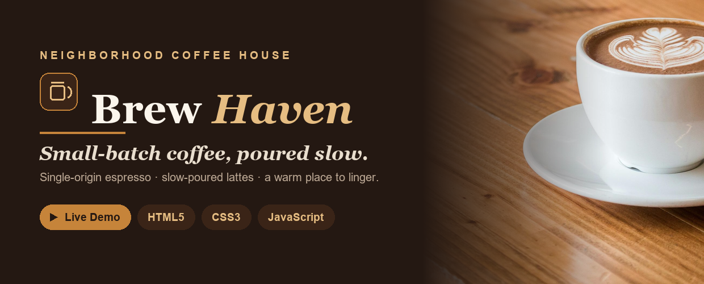

<div align="center">

<a href="https://muhammadhasnain1-debug.github.io/brew-haven/">
  
</a>

# Brew Haven

**A neighborhood coffee house landing page — warm, cinematic and animated.**
Small-batch coffee, poured slow. Built with vanilla&nbsp;HTML · CSS · JavaScript.

<br>

[](https://muhammadhasnain1-debug.github.io/brew-haven/)


</div>

---

## ✨ Highlights

- **Cinematic parallax hero** — a full-screen latte shot with a scroll-driven parallax, drifting steam wisps and a staggered headline reveal.
- **3D tilt menu cards** — each drink lifts and tilts toward your cursor in real 3D (`perspective` + `rotateX/Y`), with the photo zooming inside.
- **Interactive order form** — pick drinks with quantity steppers and watch the **total update live**; submit runs validation and fires a confirmation toast (no backend, no charge).
- **Count-up statistics** over a dark, parallax coffee band that animate the moment they scroll into view.
- **A warm, un-templated look** — espresso / caramel / cream palette (no neon), DM Serif Display + Manrope, tactile buttons with a sweeping fill.
- **Responsive & accessible** — a slide-in mobile menu, progressive enhancement (content shows even with JS off), and full `prefers-reduced-motion` support.

---

## 🔧 What I fixed

This started as a rough three-page student project. The rebuild:

| Before | After |
| --- | --- |
| Dead nav links (`href=""`) & "Document" page titles | Working smooth-scroll nav + real SEO title/meta |
| Three near-identical pages with duplicated CSS | One cohesive single-page experience |
| Lorem ipsum and a stray *Amazon* copyright | Real, on-brand copy and footer |
| Hard-coded pixel margins, no motion | A design-token system with tasteful, guarded animation |
| A 4.4 MB hero image | Compressed to ~290 KB for a fast load |

---

## 🛠️ Built with

- **Vanilla JavaScript** — scroll reveals, 3D cursor tilt, parallax, count-up stats, the live-total order form and toast (no frameworks, no libraries)
- **Plain CSS** — custom properties, CSS 3D, keyframe animation, `backdrop-filter`, responsive grid, reduced-motion
- **Fonts** — DM Serif Display + Manrope
- **Pillow (Python)** — image compression and the README banner

---

## 🚀 Run it locally

```bash
git clone https://github.com/MuhammadHasnain1-debug/brew-haven.git
cd brew-haven
python -m http.server 8000
```

Then open `http://localhost:8000`.

---

## 📌 About this project

A café landing page built to show that a simple brief can still feel premium — the kind of
motion, hierarchy and detail I bring to small-business sites.

**More from my portfolio**
- 🕯️ [Ember & Oak](https://muhammadhasnain1-debug.github.io/ember-and-oak/) — a 3D, animated candle-brand landing page
- 🦊 [The Gilded Fox](https://muhammadhasnain1-debug.github.io/the-gilded-fox/) — a dark, cinematic speakeasy landing page
- ✒️ [Namewright](https://muhammadhasnain1-debug.github.io/namewright/) — an AI name generator with real Gemini integration
- 📊 [Team Performance Scorecard](https://muhammadhasnain1-debug.github.io/team-performance-scorecard/) — a Google Sheets dashboard
- 📈 [Sales Report Dashboard](https://muhammadhasnain1-debug.github.io/sales-report-dashboard/) — a Python + Chart.js dashboard

---

<div align="center">

Built by **[Muhammad Hasnain](https://github.com/MuhammadHasnain1-debug)**

</div>
